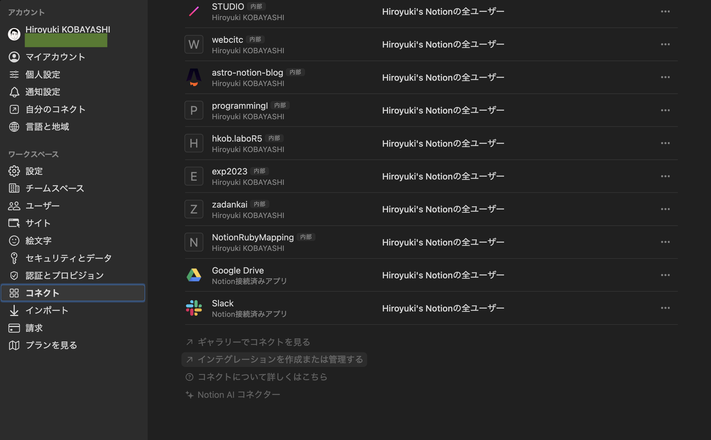
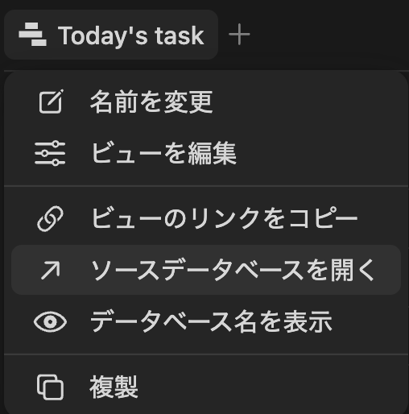
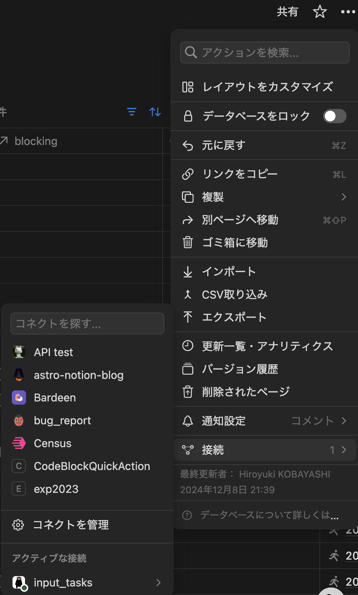

# notion-code-block-quick-action

NotionCodeBlockQuickAction.workflow は選択したテキストを codeblock として、Notion のページに追加してくれる macOS サービスです。追加先はインテグレーションを設定したページのうち、もっとも最近更新したものが選ばれます。

## インストール方法

- 以下のリンクから NotionCodeBlockQuickAction.workflow をダウンロードします。
[https://github.com/hkob/notion-code-block-quick-action/releases/download/1.1/NotionCodeBlockQuickAction.workflow.zip]

- zip ファイルのままの場合には展開します。
- workflow を実行します。
- 以下のような画面が出るので、インストールをクリックします。


- `NotionCodeBlockQuickAction` がキーボードのショートカットに現れます。チェックをつけた上で、自分の好きなショートカットを割り当ててください。ここでは、`option` + `command` + P を設定しています。


- ターミナルを立ち上げます。
- 以下のコマンドをタイプして、NotionCodeBlockQuickAction.workflow を開きます。

```sh
open $HOME/Library/Services/NotionCodeBlockQuickAction.workflow
```

- Automator が開き、以下のような画面になります。上の `Run Javascript` の部分に JXA code (JavaScript 版の AppleScript) が表示されています。


- 先頭部分に以下の 3 つの設定項目が変数で定義されています。自分のものに合わせて中身を修正してください。なお、NOTION_API_TOKEN についてわからない人は、下の NOTION API の設定を先に実施してから、値を設定してください。

```Javascript
// ########## Personal settings ##########
// Notion API Token を設定します (`secret_` で始まる文字列です)。
const NOTION_API_TOKEN = "secret_XXXXXXXXXXXXXXXXXXXXXXXX"
// デフォルトの言語
const DEFAULT_LANGUAGE = "shell"
// 登録後にページが開きます。Notion.app で開きたい人は true にしてください。false にするとデフォルトブラウザで開きます。
const OPEN_BY_APP = true
```

## Notion API の設定

初めての人のために、Notion API の設定方法も説明しておきます。

- 最初に Notion の設定を開き、インテグレーションタブを開きます。


- 次に「インテグレーションを作成または管理する」をクリックします。以下のような画面になるので、「新しいインテグレーション」をクリックします。


- 「インテグレーション名を追加」の部分の名前を設定し、ワークスペースを複数持っている人は利用するワークスペースを選択してください。画像は好きなものを設定してください。なくても問題ありません。ここで保存をするとインテグレーションが作成されます。


- 以前は、機能は保存前に設定していましたが、最近は保存後に設定するようになりました。コンテンツ機能は今回すべてチェックします(デフォルトでこうなっています)。ユーザに関する情報は必要ないので、ユーザー情報なしでよいです。


- 内部インテグレーションシークレットの部分にシークレットが表示されます。「表示」をクリックすると`ntn_`で始まる文字列が表示されます(以前は`secret_`でしたが、最近変更になっています)。右にあるコピーをクリックするとクリップボードにコピーされるので、NotionQuickAction の NOTION_API_TOKEN の部分に貼り付けてください。


## インテグレーションの許可

次に利用するデータベースを開きます。リンクドビューの場合には、ビューのタイトルの場所で右ボタンメニューを表示し、「ソースデータベースを開く」としてデータベース本体を開きます。


このデータベースを API からアクセスできるように、右上の「…」から「接続」を選び、インテグレーションキーを選択します。



## 使い方

テキストを選択できサービスを利用できるアプリであれば、このサービスは利用可能です。
(例: VSCode はテキストサービスを利用できないようです。こちらは [VSCode の機能拡張](https://github.com/hkob/code-block-to-notion)の方を利用ください。

テキストを選択後にショートカットキーをタイプすると、言語選択画面が出てきます。
一覧に表示されるものが利用可能ですので、表示してあるもののいずれかをタイプしてください。
もし、未設定の場合や一覧に存在しない言語を設定した場合には、DEFAULT_LANGUAGE に設定したものが自動設定されます。
デフォルトでは shell になっています。自分のよく使うものに変更しておいてください。

言語を設定すると、もっとも最近編集したページの一番下に code block が登録されます。
その後、Notion アプリか、デフォルトのブラウザでページが表示されます。
Notion アプリで表示したい人は OPEN_BY_APP を true に、ブラウザで表示したい人は false に設定してください。


- [blog in Japanese](https://hkob.hatenablog.com/entry/2024/12/16/0500000)

## 更新履歴

- Ver. 1.1
  - Database の query を search end point に変更
- Ver. 1.0
  - 最初のリリース
