# notion-code-block-quick-action

NotionCodeBlockQuickAction.workflow は選択したテキストを codeblock として、Notion のページに追加してくれる macOS サービスです。ページは指定したデータベースのうち、もっとも最近更新したものが選ばれます。

## インストール方法

- 以下のリンクから NotionCodeBlockQuickAction.workflow をダウンロードします。
[https://github.com/hkob/notion-code-block-quick-action/releases/download/1.0/NotionCodeBlockQuickAction.workflow.zip]

- zip ファイルのままの場合には展開します。
- workflow を実行します。
- 以下のような画面が出るので、インストールをクリックします。

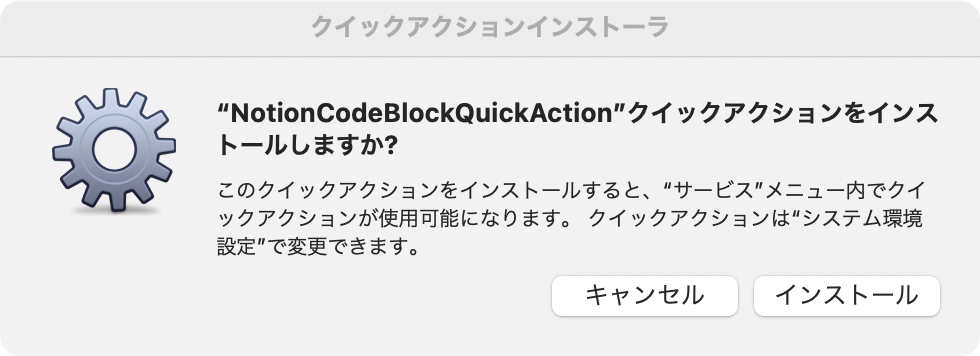

- `NotionCodeBlockQuickAction` がキーボードのショートカットに現れます。チェックをつけた上で、自分の好きなショートカットを割り当ててください。ここでは、`option` + `command` + P を設定しています。

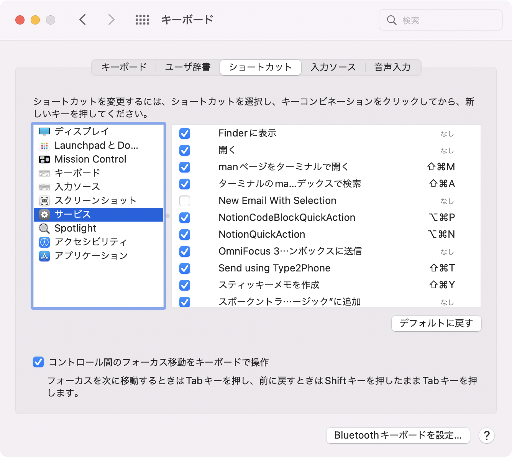

- ターミナルを立ち上げます。
- 以下のコマンドをタイプして、NotionCodeBlockQuickAction.workflow を開きます。

```sh
open $HOME/Library/Services/NotionCodeBlockQuickAction.workflow
```

- Automator が開き、以下のような画面になります。上の `Run Javascript` の部分に JXA code (JavaScript 版の AppleScript) が表示されています。

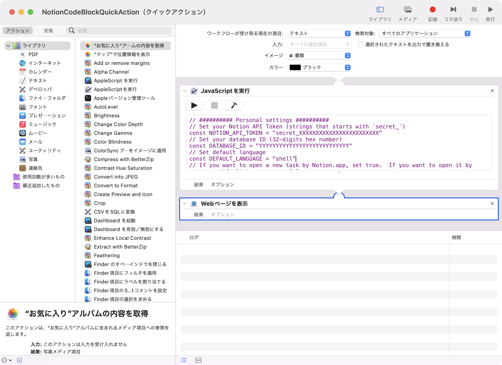

- Rewrite some values

- 先頭部分に以下の 4 つの設定項目が変数で定義されています。自分のものに合わせて中身を修正してください。なお、NOTION_API_TOKEN や DATABASE_ID についてわからない人は、下の NOTION API の設定を先に実施してから、値を設定してください。

```Javascript
// ########## Personal settings ##########
// Notion API Token を設定します (`secret_` で始まる文字列です)。
const NOTION_API_TOKEN = "secret_XXXXXXXXXXXXXXXXXXXXXXXX"
// 登録するタスクデータベースの ID を設定します (32桁の16進数です)。
const DATABASE_ID = "YYYYYYYYYYYYYYYYYYYYYYYYYYY"
// デフォルトの言語
const DEFAULT_LANGUAGE = "shell"
// 登録後にページが開きます。Notion.app で開きたい人は true にしてください。false にするとデフォルトブラウザで開きます。
const OPEN_BY_APP = true
```

## Notion API の設定

初めての人のために、Notion API の設定方法も説明しておきます。

- 最初に Notion の設定を開き、インテグレーションタブを開きます。
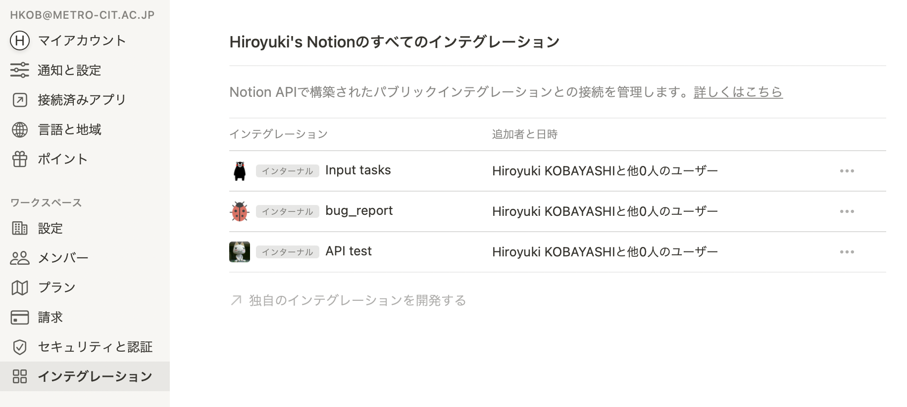

- 次に「独自のインテグレーションを開始する」をクリックします。以下のような画面になるので、「新しいインテグレーション」をクリックします。
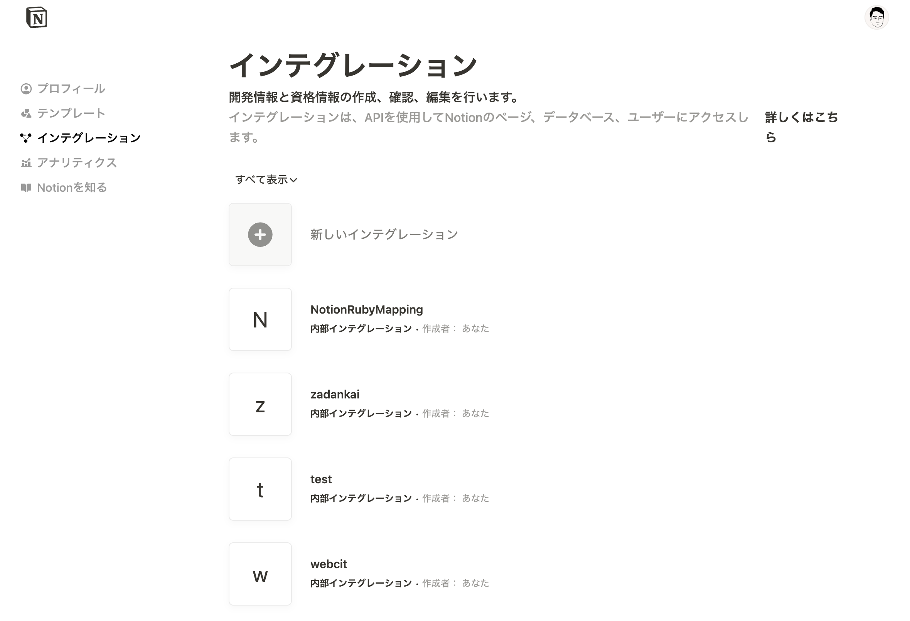

- 上の部分の名前、画像は好きなものを設定してください。ワークスペースは自動的に設定されているはずです。複数のワークスペースを持っている人は利用するワークスペースを選択してください。
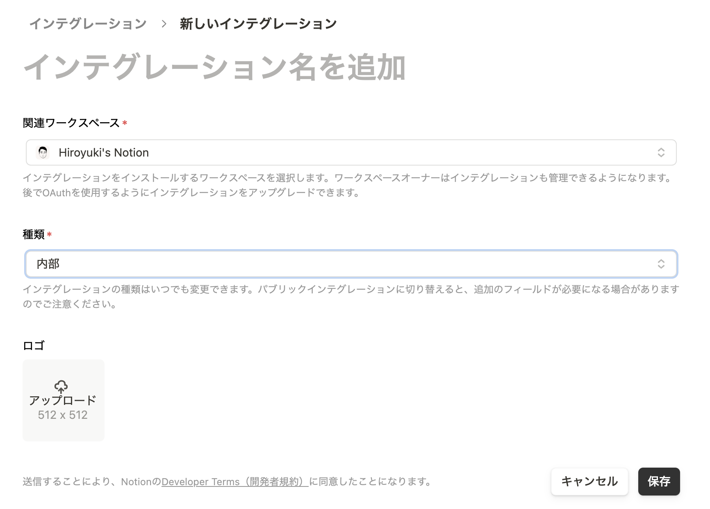

- コンテンツ機能は今回すべてチェックします。ユーザに関する情報は必要ないので、ユーザー情報なしでよいです。
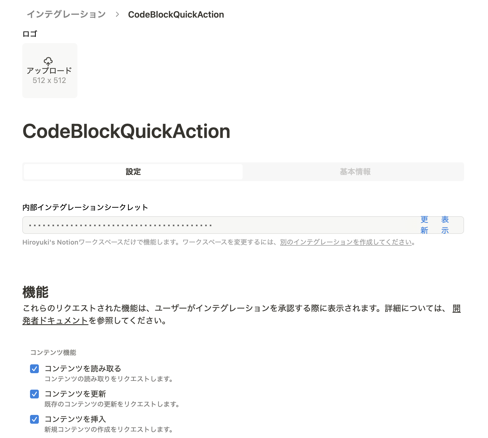

- 送信をクリックすると画面が変わり、上にシークレットが表示されます。「表示」をクリックすると `secret_` で始まる文字列が表示されます。右にあるコピーをクリックするとクリップボードにコピーされるので、NotionQuickAction の NOTION_API_TOKEN の部分に貼り付けてください。
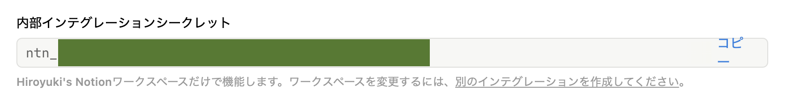

## インテグレーションの許可

次に登録するデータベースを開きます。リンクドデータベースがある場合には、`右上矢印 + データベース名` の部分をクリックすればデータベースのページが単体で開きます。インラインのデータベースの場合には、`...` から「ページとして開く」をクリックして開きます。
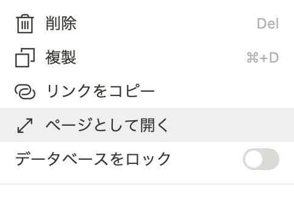

このデータベースを API からアクセスできるように、右上の`共有`で開くダイアログにて先ほど作成したインテグレーションを招待します。
追加ができるように編集権限を与えてください。

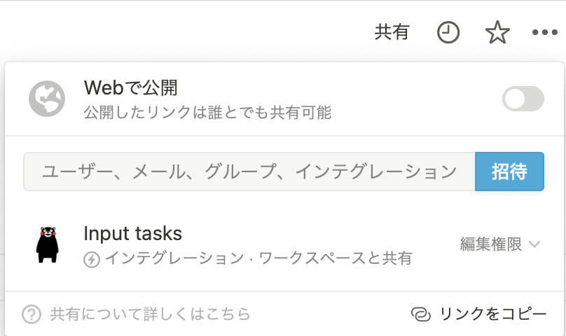

## データベース id の取得

最後に DATABASE_ID を取得します。許可したデータベースをページで表示した状態で、メニューから「リンクをコピー」をクリックします。

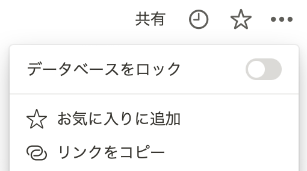

コピーしたリンクは以下の形式になっています。この 32 桁の XXXX... の部分がデータベース ID になります。この部分だけを取り出して、ワークシートの DATABASE_ID に設定してください。

```text
https://www.notion.so/hkob/XXXXXXXXXXXXXXXXXXXXXXXXXXXXXXXX?v=YYYYYYYYYYYYYYYYYYYYYYYYYYYYYYYY
```

## 使い方

テキストを選択できサービスを利用できるアプリであれば、このサービスは利用可能です。
(例: VSCode はテキストサービスを利用できないようです。こちらは [VSCode の機能拡張](https://github.com/hkob/code-block-to-notion)の方を利用ください。

テキストを選択後にショートカットキーをタイプすると、言語選択画面が出てきます。
一覧に表示されるものが利用可能ですので、表示してあるもののいずれかをタイプしてください。
もし、未設定の場合や一覧に存在しない言語を設定した場合には、DEFAULT_LANGUAGE に設定したものが自動設定されます。
デフォルトでは shell になっています。自分のよく使うものに変更しておいてください。

言語を設定すると、もっとも最近編集したページの一番下に code block が登録されます。
その後、Notion アプリか、デフォルトのブラウザでページが表示されます。
Notion アプリで表示したい人は OPEN_BY_APP を true に、ブラウザで表示したい人は false に設定してください。


- [blog in Japanese](https://hkob.hatenablog.com/entry/2022/01/10/133000)

## 更新履歴

- Ver. 1.0
  - 最初のリリース
