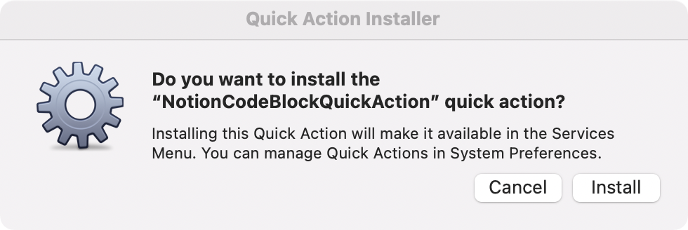
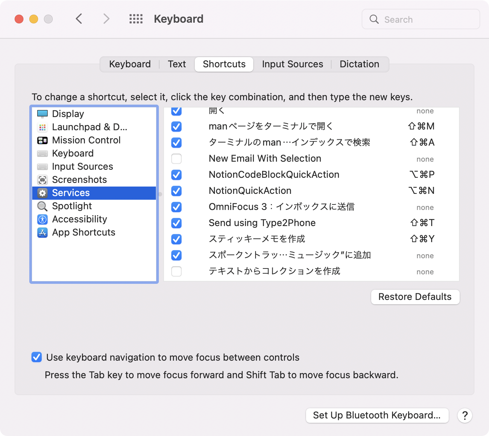
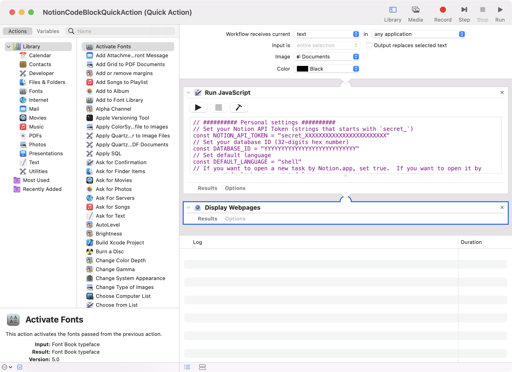
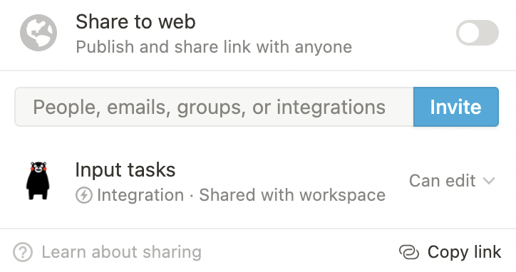

# notion-code-block-quick-action

a macOS service to append a new code block to the most recent updated page

[日本語版 README はこちら](README.ja.md)

## How to install

- Download workflow from here
[https://github.com/hkob/notion-code-block-quick-action/releases/download/1.0/NotionCodeBlockQuickAction.workflow.zip]

- Unpack the zip file
- Down click the workflow file
- Click Install in the following dialog



- Enable `NotionQuickAction` and set a shortcut key.  In this figure, I set `option` + `command` + N.



- Open Terminal software.
- Open NotionQuickAction.workflow by the following terminal command.

```sh
open $HOME/Library/Services/NotionQuickAction.workflow
```

- We can see a JXA code in a `Run JavaScript` action.



- Rewrite some values

The following 4 values must be adjust to your environment.
In you don't know about NOTION_API_TOKEN and DATABASE_ID,
please read the below Notion API setup.

```Javascript
// ########## Personal settings ##########
// Set your Notion API Token (strings that starts with `secret_`)
const NOTION_API_TOKEN = "secret_XXXXXXXXXXXXXXXXXXXXXXXX"
// Set your database ID (32-digits hex number)
const DATABASE_ID = "YYYYYYYYYYYYYYYYYYYYYYYYYYY"
// Set default language
const DEFAULT_LANGUAGE = "shell"
// If you want to open a new task by Notion.app, set true.  If you want to open it by your default browser, set false.
const OPEN_BY_APP = true
```

## Notion API setup

Next, set API setting. Please see Getting Started in the Notion Developer page. Please remind NOTION_API_TOKEN and database_id for the above database (DATABASE_ID), and invite your integration to the databases.



## How to use

Any application that allows text selection can be used.
After you selected some text, press the shortcut key for NotionCodeBlockQuickAction.
Then, type the language for the selected text.
If you don't input any text or input an illegal language,
DEFAULT_LANGUAGE is used for the language for the selected text.

After you press the return key or press the `CONTINUE` button, a code block is appended to the most recent page in the database in a few seconds and is displayed in Notion.app or your default browser.


- [blog in Japanese](https://hkob.hatenablog.com/entry/2022/01/10/133000)

## Change Log

- Ver. 1.0
  - First release
