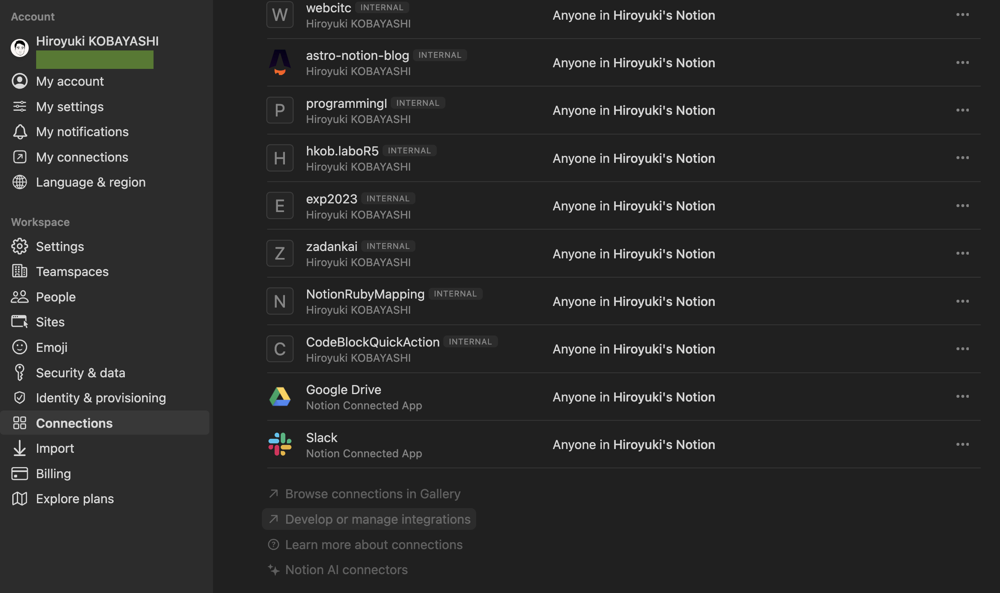
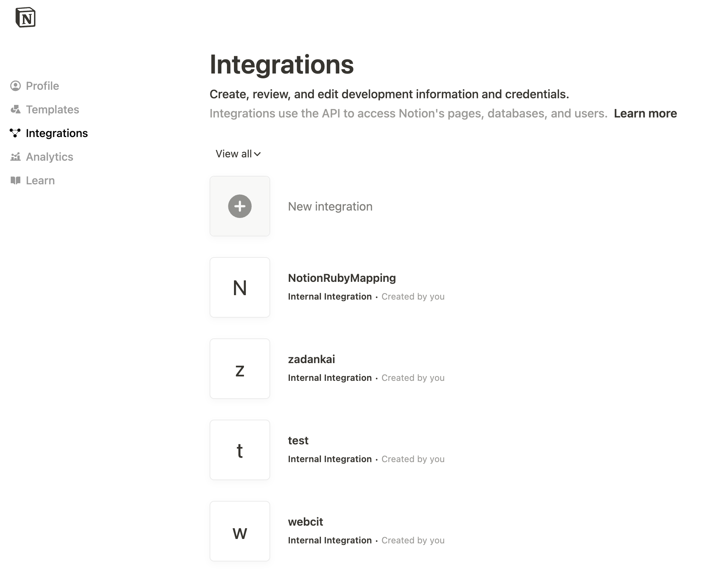
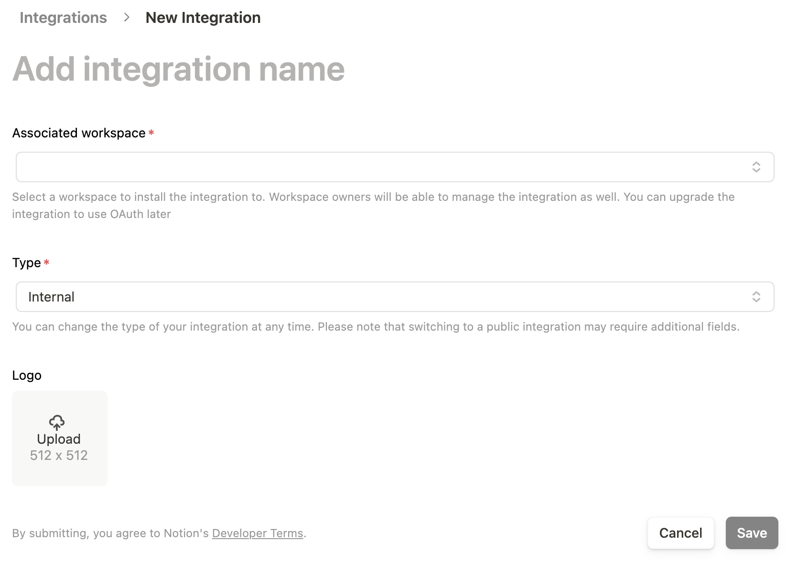
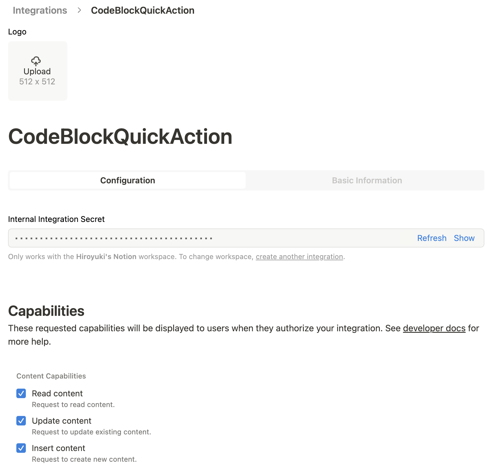
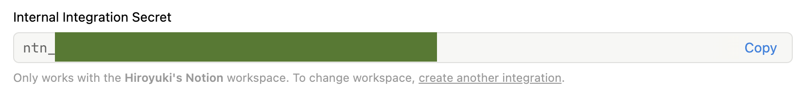
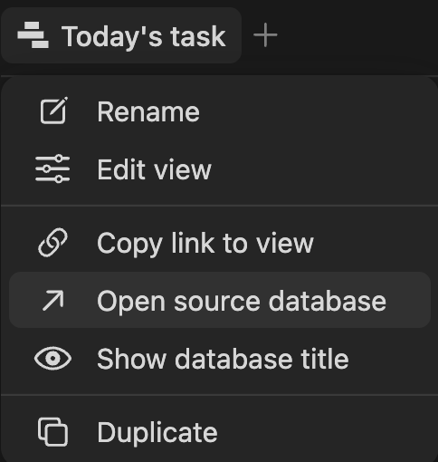
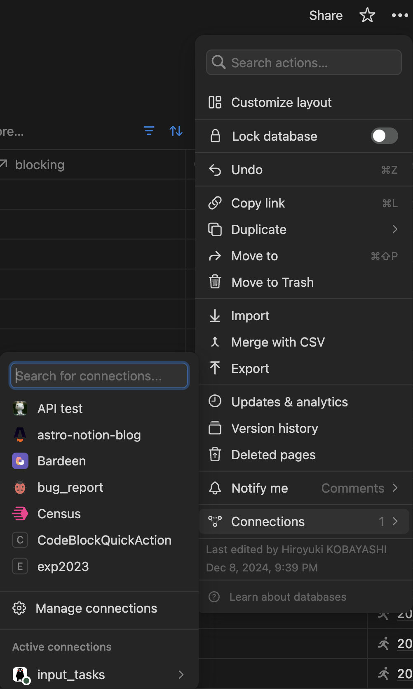

# notion-code-block-quick-action

NotionCodeBlockQuickAction.workflow is a macOS service that adds selected text as a codeblock to your Notion pages. It will be added to the most recently updated page among those configured with the integration.

[日本語版 README はこちら](README.ja.md)

## How to install

- Download NotionCodeBlockQuickAction.workflow from the link below.
[https://github.com/hkob/notion-code-block-quick-action/releases/download/1.1/NotionCodeBlockQuickAction.workflow.zip]

- If the file is still in zip format, extract it.
- Run the workflow.
- The following screen will appear, click Install.


- Enable `NotionQuickAction` and set a shortcut key.  In this figure, I set `option` + `command` + P.


- Launch Terminal.
- Type the following command to open NotionCodeBlockQuickAction.workflow:

```sh
open $HOME/Library/Services/NotionCodeBlockQuickAction.workflow
```

- Automator will open and you will see a screen like the one below. The JXA code (JavaScript version of AppleScript) is displayed in the Run Javascript section at the top.


The following 3 configuration items are defined as variables at the beginning. Please modify the contents to match your own settings. If you are not familiar with the NOTION_API_TOKEN, please set up the NOTION API settings below first, then set the value.

```Javascript
// ########## Personal settings ##########
// Set your Notion API Token (strings that starts with `secret_`)
const NOTION_API_TOKEN = "secret_XXXXXXXXXXXXXXXXXXXXXXXX"
// Set default language
const DEFAULT_LANGUAGE = "shell"
// If you want to open a new task by Notion.app, set true.  If you want to open it by your default browser, set false.
const OPEN_BY_APP = true
```

For those who are new, I will also explain how to set up the Notion API.

- First, open Notion settings and go to the Connections tab.


- Next, click on "Create or manage integrations". The following screen will appear, then click on "New integration".


- Set a name in the "Add integration name" field, and if you have multiple workspaces, select the workspace you want to use. You can set any image you like for the icon. It's fine if you don't set one. Once you click save, the integration will be created.


- Previously, features were configured before saving, but recently it has been changed to configure after saving. We will check all content capabilities this time (this is the default). Since we don't need user-related information, you can leave user information unchecked.


- The internal integration secret will be displayed in the secret section. Click "Show" to display a string that starts with `ntn_` (it used to start with `secret_`, but this has recently changed). Click the copy button on the right to copy it to your clipboard, then paste it into the NOTION_API_TOKEN section of NotionQuickAction.


## Integration Authorization

Next, open the database you want to use. For linked views, right-click on the view title and select "Open source database" to access the main database.



To enable API access to this database, click on "..." in the top right, select "Connections", and choose your integration key.



## How to use

This service can be used in any application that allows text selection and supports services.
(Note: VSCode does not seem to support text services. Please use the [VSCode extension](https://github.com/hkob/code-block-to-notion) instead.)

After selecting text and typing the shortcut key, a language selection screen will appear.
The available languages are shown in the list, so please type one of the displayed options.
If no language is set or if you set a language that doesn't exist in the list, it will automatically use the language specified in DEFAULT_LANGUAGE.
By default, it's set to shell. Please change it to the language you use most frequently.

After setting the language, a code block will be added to the bottom of your most recently edited page.
Afterwards, the page will open either in the Notion app or your default browser.
If you want to open it in the Notion app, set OPEN_BY_APP to true; if you prefer the browser, set it to false.


- [blog in Japanese](https://hkob.hatenablog.com/entry/2024/12/16/0500000)

## Change Log

- Ver. 1.1
  - Changed database query to search endpoint
- Ver. 1.0
  - First release
